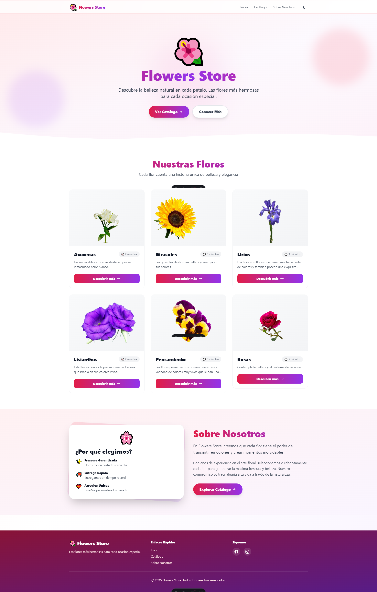
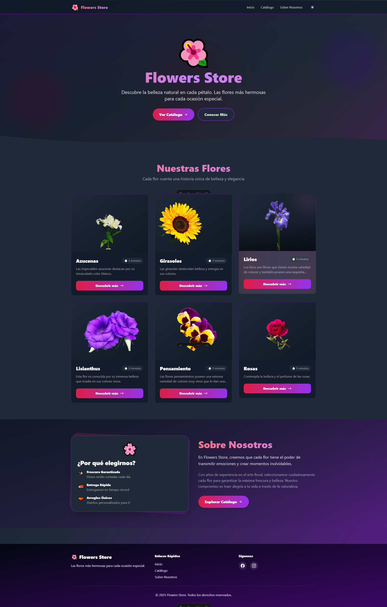

# 🌺 Flowers Store

> Una landing page moderna y elegante para una tienda de flores, construida con Astro y Tailwind CSS.

[](https://floral-sky.vercel.app/)
[](https://astro.build)
[](https://tailwindcss.com)

## 🌐 Demo en Vivo

**[Ver Demo → https://floral-sky.vercel.app/](https://floral-sky.vercel.app/)**

---

## 📸 Capturas de Pantalla

### Modo Light


### Modo Dark


---

## ✨ Características

### 🎨 Diseño Moderno
- **Dark Mode** - Tema claro/oscuro con transiciones suaves
- **Glassmorphism** - Efectos de vidrio esmerilado en tarjetas
- **Gradientes Vibrantes** - Colores modernos de rosa a púrpura
- **Responsive Design** - Perfecto en móvil, tablet y desktop
- **Animaciones Suaves** - Micro-interacciones en toda la interfaz

### 🚀 Funcionalidades Avanzadas
- **Scroll Animations** - Elementos que aparecen al hacer scroll (Intersection Observer)
- **Parallax Scrolling** - Efecto de profundidad 3D en el hero
- **Progress Bar** - Barra de progreso de lectura en la parte superior
- **Ripple Effects** - Efectos de onda en botones al hacer hover
- **Smooth Scroll** - Navegación suave entre secciones

### 🛠️ Tecnologías
- **Astro 5.0+** - Framework moderno para sitios web ultrarrápidos
- **Tailwind CSS 3.4+** - Utility-first CSS framework
- **TypeScript** - Tipado estático para mejor desarrollo
- **Vercel** - Deploy continuo y hosting

---

## 🎯 Estructura del Proyecto

```
Flowers-Store/
├── public/
│   ├── azucenas.png
│   ├── girasol.png
│   ├── lirio.png
│   ├── lisianthus.png
│   ├── pensamiento.png
│   └── rosa.png
├── src/
│   ├── components/
│   │   ├──ScrollAnimations.astro
        ├── AmazonLogo.astro
        ├── BuyButton.astro
        ├── FlowerCard.astro
        └── FlowerScore.astro
│   ├── layouts/
│   │   └── Layout.astro
│   └── pages/
│       ├── index.astro
│       └── flower/
│           └── [slug].astro
├── astro.config.mjs
├── tailwind.config.mjs
├── tsconfig.json
├── package.json
└── README.md
```

---

## 🚀 Inicio Rápido

### Prerequisitos
- Node.js 18.0 o superior
- pnpm, npm o yarn

### Instalación

1. **Clonar el repositorio**
```bash
git clone https://github.com/zeuschris/Flower-Store.git
cd Flower-Store
```

2. **Instalar dependencias**
```bash
pnpm install
# o
npm install
```

3. **Iniciar servidor de desarrollo**
```bash
pnpm dev
# o
npm run dev
```

4. **Abrir en el navegador**
```
http://localhost:4321
```

---

## 📦 Scripts Disponibles

```bash
pnpm dev          # Iniciar servidor de desarrollo
pnpm build        # Construir para producción
pnpm preview      # Previsualizar build de producción
pnpm astro        # Ejecutar comandos de Astro CLI
```

---

## 🎨 Características Técnicas

### Animaciones de Scroll
Utilizando Intersection Observer API para animaciones eficientes:
- `fade-up` - Aparece desde abajo
- `fade-down` - Aparece desde arriba
- `fade-left` - Aparece desde la derecha
- `fade-right` - Aparece desde la izquierda
- `scale` - Escala desde pequeño
- `rotate` - Con rotación

### Parallax Effect
Elementos de fondo con diferentes velocidades de scroll:
- Capa 1: velocidad 0.3x
- Capa 2: velocidad 0.5x
- Capa 3: velocidad 0.2x

### Dark Mode
- Detección automática del tema del sistema
- Persistencia en localStorage
- Transiciones suaves (300ms)
- Toggle en navbar (desktop y móvil)

### Progress Bar
- Se actualiza en tiempo real con el scroll
- Gradiente de colores personalizado
- Performance optimizado con `passive: true`

---

## 🌸 Catálogo de Flores

El sitio presenta 6 tipos de flores:

1. **Azucenas** - Elegancia y pureza
2. **Girasoles** - Alegría y vitalidad
3. **Lirios** - Sofisticación y fragancia
4. **Lisianthus** - Belleza delicada
5. **Pensamiento** - Variedad de colores
6. **Rosas** - Belleza atemporal

Cada flor incluye:
- ✅ Imagen de alta calidad
- ✅ Descripción detallada
- ✅ Características principales
- ✅ Consejos de cuidado
- ✅ Precio y enlace a Amazon
- ✅ Tiempo de lectura estimado

## 🛠️ Configuración

### Tailwind CSS
El proyecto usa configuración personalizada en `tailwind.config.mjs`:

```javascript
export default {
  content: ['./src/**/*.{astro,html,js,jsx,md,mdx,svelte,ts,tsx,vue}'],
  darkMode: 'class',
  theme: {
    extend: {
      animation: {
        'float': 'float 6s ease-in-out infinite',
      },
      // ...más configuración
    },
  },
}
```

### Astro Config
Configuración en `astro.config.mjs`:

```javascript
export default defineConfig({
  integrations: [
    tailwind(),
    vercel()
  ],
})
```

---

## 📱 Responsive Breakpoints

```css
/* Mobile First */
Default:     < 768px   (móvil)
md:          >= 768px  (tablet)
lg:          >= 1024px (desktop)
xl:          >= 1280px (desktop grande)
2xl:         >= 1536px (pantallas ultra anchas)
```

---

## 🎨 Paleta de Colores

### Light Mode
- **Primary**: `#e11d48` (Rose 600)
- **Secondary**: `#9333ea` (Purple 600)
- **Background**: Gradiente de rosa claro a púrpura claro
- **Text**: `#1f2937` (Gray 900)

### Dark Mode
- **Primary**: `#fb7185` (Rose 400)
- **Secondary**: `#c084fc` (Purple 400)
- **Background**: Gradiente de gris oscuro a púrpura oscuro
- **Text**: `#ffffff` (White)


## 📄 Licencia

Este proyecto está bajo la Licencia MIT. Ver el archivo `LICENSE` para más detalles.

---

## 👤 Autor

**Christopher Montes**

- GitHub: [@zeuschris](https://github.com/zeuschris)
- Proyecto: [Flowers Store](https://github.com/zeuschris/Flower-Store)
- Demo: [https://floral-sky.vercel.app/](https://floral-sky.vercel.app/)

---
